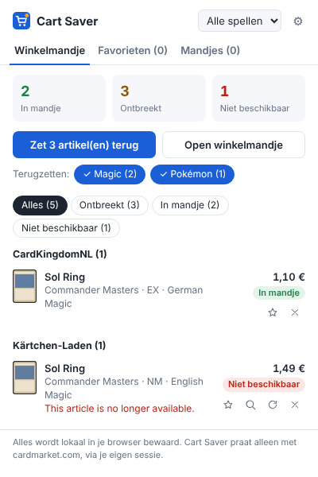
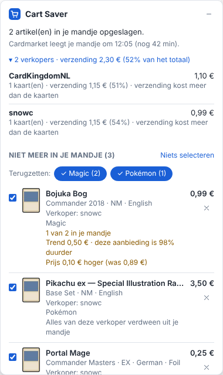
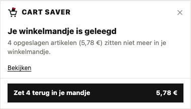
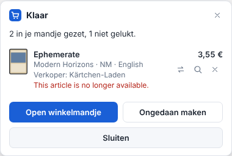
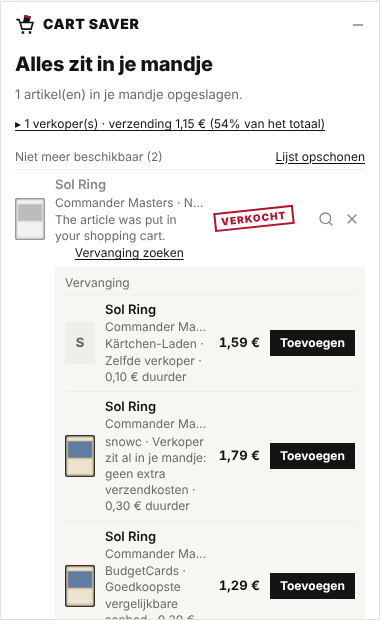
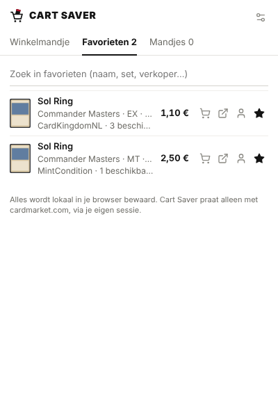
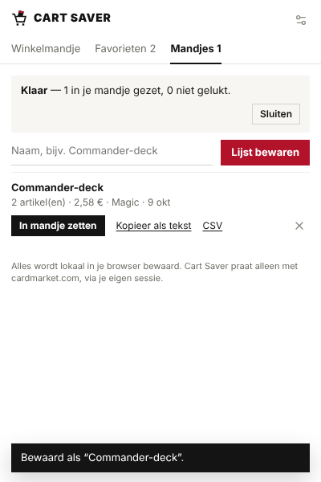

<p align="center">
  
</p>

<h1 align="center">CART SAVER</h1>

<p align="center">
  <b>Je Cardmarket-mandje kwijt? Eén klik en het staat er weer in.</b><br>
  Een Chrome-extensie voor <a href="https://www.cardmarket.com">Cardmarket</a>.
</p>

<p align="center">
  
  &nbsp;
  
</p>

---

## Waarvoor

Wie op Cardmarket een deck bij elkaar zoekt, legt vaak tientallen kaarten van
verschillende verkopers in zijn mandje, in precies de goede conditie en taal.
Cardmarket **leegt dat mandje vanzelf**: na verloop van tijd, als een
verkoper op vakantie gaat of als iets verkocht wordt. Al dat zoekwerk is dan
weg.

**Cart Saver onthoudt alles wat je in je mandje legt** en zet het met één
klik terug, zolang het nog te koop is. Is iets verkocht, dan zoekt hij een
vervanging.

## Wat je krijgt

| | |
|---|---|
| **Automatisch onthouden** | Elk artikel in je mandje wordt bewaard: kaart, verkoper, conditie, taal, foil, prijs en aantal. Je hoeft niets te doen. |
| **Eén klik terug** | Eén verzoek per verkoper, en alleen wat echt ontbreekt. Dus ook "1 van 2 in je mandje" wordt aangevuld. Spijt? *Ongedaan maken*. |
| **Weten wat er gebeurde** | Per artikel zie je of het mandje werd geleegd, of de verkoper verdween of dat alleen dit artikel verkocht is, en of de prijs veranderde. |
| **Vervanging voor verkochte kaarten** | Dezelfde kaart bij dezelfde verkoper, bij een verkoper die al in je mandje zit (geen extra verzending), of het goedkoopste vergelijkbare aanbod. |
| **Alle spellen in één mandje** | Magic, Pokémon, Yu-Gi-Oh!, One Piece, Lorcana… Kies zelf welke spellen terug moeten. |
| **Favorieten en bewaarde mandjes** | Bewaar een aanbieding met een ☆, of je hele lijst onder een naam ("Commander-deck") om later terug te zetten. |
| **Op tijd gewaarschuwd** | Hoe laat Cardmarket je mandje leegt, verzendkosten per verkoper, en een melding als er iets verdwijnt. |

## Zo werkt het

**1. Shop zoals altijd.** Cart Saver onthoudt wat je in je mandje legt. Op de
mandjepagina zie je rechtsonder wat er bewaard is, en wat de verzending per
verkoper kost.

**2. Mandje geleegd?** Op elke Cardmarket-pagina verschijnt een melding, en
het icoon in de werkbalk telt mee.

<p align="center">
  
</p>

**3. Zet terug.** Eén klik, en de kaarten liggen weer in je mandje. Wat
verkocht is krijgt een stempel, met een voorstel voor vervanging.

<p align="center">
  
  &nbsp;
  
</p>

In de popup vind je alles terug: wat terug kan (per verkoper, met de details
als je op een kaart klikt), je **favorieten** en je **bewaarde mandjes**.

<p align="center">
  
  &nbsp;
  
</p>

## Installeren

Cart Saver staat (nog) niet in de Chrome Web Store; je laadt hem zelf:

1. **Download** de [ZIP](https://github.com/MilanVeenstra/CardmarketExtension/archive/HEAD.zip) en pak hem uit.
2. Ga in Chrome naar `chrome://extensions` en zet rechtsboven **Ontwikkelaarsmodus** aan.
3. Klik op **Uitgepakte extensie laden** en kies de uitgepakte map (met `manifest.json`).
4. Ververs je open Cardmarket-tabbladen.

Werkt ook in Edge, Brave en Opera.

<details>
<summary><b>Automatisch bijwerken (Mac)</b></summary>

Wil je elke nieuwe versie vanzelf binnenkrijgen? Eén keer instellen:

1. Zoek op `chrome://extensions` bij Cart Saver de regel **Geladen vanaf**: dat is je extensiemap.
2. Open **Terminal**, typ `cd ` en sleep die map in het venster. Druk op Enter.
3. Voer uit:
   ```bash
   bash scripts/autoupdate-mac.sh install "$PWD"
   ```
   Vraagt je Mac om de *Command Line Tools*? Installeer ze en herhaal stap 3.
4. Klik één keer op ↻ bij Cart Saver.

Daarna kijkt je Mac elke 3 minuten of er een nieuwe versie is; de extensie
herstart zichzelf en open tabbladen vragen om te verversen. Je opgeslagen
artikelen blijven bewaard. Status: `bash scripts/autoupdate-mac.sh status`,
uitzetten: `bash scripts/autoupdate-mac.sh uninstall`.

</details>

## Privacy

- Alles blijft in je eigen browser. Er is geen server en er wordt niets
  verstuurd.
- Cart Saver praat alleen met cardmarket.com, via je eigen ingelogde sessie.
  Er worden geen wachtwoorden bewaard.
- Optioneel (standaard uit): één keer per dag de openbare prijsgids van
  Cardmarket downloaden om prijzen met de trend te vergelijken.

## Goed om te weten

- Cart Saver is **onofficieel** en niet verbonden aan Cardmarket. Hij gebruikt
  dezelfde verzoeken als de knoppen op de site. Verandert Cardmarket iets,
  dan doet hij liever niets dan iets fout: een mandje dat hij niet goed kan
  lezen markeert hij nergens als leeg.
- Een opgeslagen artikel is één aanbieding van één verkoper. Is die verkocht,
  dan kan hij niet terug; gebruik dan *Vervanging zoeken*.
- Gebruik het met mate: verzoeken gaan alleen na jouw klik (of als je mandje
  veranderde), één tegelijk en met een pauze ertussen.

<details>
<summary><b>Voor ontwikkelaars</b></summary>

Geen build-stap: Chrome laadt de bestanden direct (Manifest V3, gewone
HTML/CSS/JS).

```
manifest.json
src/
  shared/      store.js (gegevens en opslag), ui.js (stijl en componenten), i18n.js
  content/     cardmarket.js (kennis van de site), refill.js (terugzetten),
               replace.js (vervanging), widget.js (paneel), favorites.js (sterren),
               thumbs.js (plaatjes), main.js (opstarten, mandje lezen)
  page/        bridge.js (verzoeken vanuit de pagina zelf, via een privé kanaal)
  popup/       popup.html/css/js
  options/     options.html/css/js
  background/  service-worker.js (badge, meldingen, zelf bijwerken, prijsgids)
_locales/      nl, en
scripts/       autoupdate-mac.sh, make-icons.mjs
tests/         end-to-end-tests tegen een nagebootste Cardmarket
docs/          onderzoek, functionele eisen, design-brief, screenshots
```

De tests laden de echte extensie in Chromium (Playwright) en sturen
`https://www.cardmarket.com` naar een nagebootste site met dezelfde HTML en
endpoints:

```bash
npm install
npm test                          # alle tests
SCREENSHOT_DIR=shots npm test     # ook screenshots
```

Meer achtergrond: [onderzoek](docs/RESEARCH.md),
[functionele eisen](docs/REQUIREMENTS.md),
[analyse van de cart saver](docs/CART-SAVER-ANALYSE.md),
[analyse voor 1.6](docs/ANALYSE-1.6.md) en de
[design-brief](docs/DESIGN-BRIEF.md).

</details>
