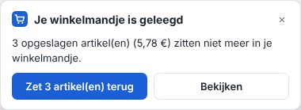
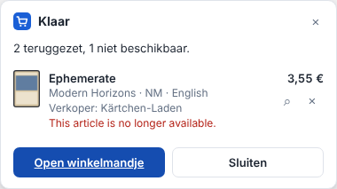
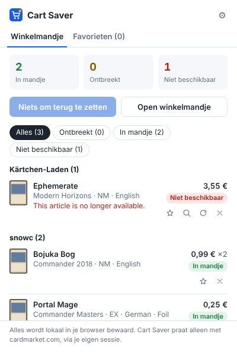
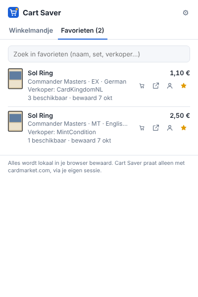

# Cardmarket Cart Saver

Een Chrome-extensie die onthoudt wat je in je
[Cardmarket](https://www.cardmarket.com)-winkelmandje legt. Als Cardmarket je
mandje (automatisch) leegt, zet je alles met één klik terug, tenminste zolang
de artikelen nog te koop zijn.

<p>
  
  
</p>
<p>
  
  
</p>

## Wat het doet

- **Automatisch opslaan.** Elk artikel dat in je winkelmandje komt, wordt
  lokaal bewaard met:
  - verkoper, conditie, taal, foil;
  - prijs, aantal en link.

  Dat werkt ook als je iets toevoegt met de gewone knoppen van Cardmarket.
- **Leeg mandje herkennen.** Zodra opgeslagen artikelen uit je mandje
  verdwijnen:
  - verschijnt er een melding op Cardmarket;
  - toont het icoon in de werkbalk hoeveel artikelen ontbreken.
- **Met één klik terugzetten.**
  - Artikelen gaan één voor één terug in je mandje, met een pauze ertussen.
  - Wat al in je mandje zit, wordt overgeslagen.
  - Wat intussen verkocht is, wordt gemarkeerd als *niet meer beschikbaar*, met
    een knop om vergelijkbaar aanbod te zoeken (zelfde taal, minimaal dezelfde
    conditie, zelfde foil).
- **Favorieten.** Klik op de ☆ bij een aanbieding om dat specifieke artikel
  van die verkoper te bewaren. Dat kan op productpagina's, kaartpagina's,
  verkoperspagina's en in je winkelmandje. In de popup onder **Favorieten**
  kun je zoeken op naam, set of verkoper. Per favoriet kun je:
  - de aanbieding openen: de pagina scrolt ernaartoe en markeert hem;
  - bij de verkoper zoeken;
  - hem met één klik in je winkelmandje leggen (1 exemplaar).

  Prijs en voorraad worden bijgewerkt zodra je de aanbieding weer tegenkomt.
  Is hij verkocht, dan zie je dat bij de favoriet, met links naar de
  verkoper en naar vergelijkbaar aanbod.
- **Gekochte artikelen** verdwijnen vanzelf uit de lijst zodra je de bestelling
  op Cardmarket opent. Wat je zelf met het prullenbakje uit je mandje haalt,
  wordt ook vergeten.
- **Werkt voor alle spellen op Cardmarket** (Magic, Pokémon, Yu-Gi-Oh!, One
  Piece, Lorcana, …) en in alle sitetalen.
- **Privacy.**
  - Alles blijft in je eigen browser (`chrome.storage.local`).
  - De extensie praat alleen met cardmarket.com, via je eigen ingelogde sessie.
  - Er worden geen wachtwoorden opgeslagen en er is geen externe server.

## Installeren

De extensie staat (nog) niet in de Chrome Web Store. Je laadt haar als
"uitgepakte extensie":

1. Download deze repository, via **Code → Download ZIP** (en pak uit) of met
   `git clone`.
2. Ga in Chrome naar `chrome://extensions`.
3. Zet rechtsboven **Ontwikkelaarsmodus** aan.
4. Klik op **Uitgepakte extensie laden** en kies de map van deze repository
   (de map met `manifest.json`).
5. Optioneel: pin het icoon via het puzzelstukje in de werkbalk.
6. Ververs tabbladen van Cardmarket die al open stonden.

Dit werkt ook in andere Chromium-browsers zoals Edge, Brave en Opera.

## Gebruik

1. Log in op Cardmarket en leg zoals altijd kaarten in je winkelmandje. Open
   je winkelmandje één keer: rechtsonder zie je *Cart Saver · X opgeslagen*.
2. Wordt je mandje later geleegd? Dan verschijnt op Cardmarket de melding
   **"Je winkelmandje is geleegd"**. Klik op **Zet terug**, of kies op de
   winkelmandjepagina zelf welke artikelen je terug wilt.
3. Zie je een aanbieding die je later misschien wilt kopen? Klik op de ☆
   ernaast. Je vindt hem terug in de popup onder **Favorieten**.
4. Je kunt ook het icoon in de werkbalk gebruiken. De popup toont alle
   opgeslagen artikelen per verkoper en kan het terugzetten starten. Zit je
   niet op Cardmarket, dan opent hij je winkelmandje en begint het terugzetten
   vanzelf.

**Instellingen** (tandwiel in de popup):

- automatisch opslaan aan/uit;
- de melding op Cardmarket aan/uit;
- de pauze tussen artikelen (standaard 1,2 s);
- export en import (JSON), inclusief favorieten;
- alles wissen.

## Goed om te weten

- Cart Saver is **onofficieel** en niet verbonden aan Cardmarket. Hij gebruikt
  dezelfde verzoeken als de knoppen op de site zelf, maar als Cardmarket de site
  verandert, kan de extensie stoppen met werken. In dat geval weigert hij liever
  iets te doen dan iets fout te doen:
  - hij markeert niets als ontbrekend als het mandje niet goed te lezen is;
  - hij stopt bij een Cloudflare-controle of als je bent uitgelogd.
- Een opgeslagen artikel is één specifieke aanbieding van één verkoper. Is die
  verkocht, dan kan Cart Saver hem niet terugzetten. Gebruik dan de knop
  *Zoek vergelijkbaar aanbod*.
- Gebruik het met mate. Cardmarket waarschuwt dat tools van derden voor eigen
  risico zijn, en te veel verzoeken in korte tijd leiden tot een tijdelijke
  blokkade. De extensie doet alleen iets na een klik van jou, één artikel
  tegelijk.

## Hoe het werkt

Het volledige vooronderzoek staat in [docs/RESEARCH.md](docs/RESEARCH.md).
Een overzicht van alle functies en ideeën voor uitbreiding staat in
[docs/REQUIREMENTS.md](docs/REQUIREMENTS.md). Een brief voor een
(re)design staat in [docs/DESIGN-BRIEF.md](docs/DESIGN-BRIEF.md). Kort
samengevat:

- Een **content script** op `www.cardmarket.com` doet het werk:
  - het leest het winkelmandje (`tr[data-article-id]` met `data-*`-attributen);
  - het houdt de mandjesteller in de header in de gaten;
  - het zet artikelen terug met dezelfde AJAX-POST als de site
    (`AjaxAction/ShoppingCart_Add_AddArticlesFromUserOffers` met het
    `__cmtkn`-CSRF-token van je sessie).

  De verzoeken gaan via een klein script in de pagina zelf
  (`src/page/bridge.js`), precies zoals de knoppen van Cardmarket. Zo gaan
  je sessiecookies gewoon mee. Antwoordt dat script niet, dan valt de
  extensie terug op een eigen verzoek.
- **`chrome.storage.local`** bewaart de artikelen en de voortgang van het
  terugzetten. Popup en paneel lezen live mee.
- De **service worker** doet alleen het badge-getal.

```
manifest.json
src/
  shared/      store.js (datamodel + opslag), ui.js (gedeelde weergave), i18n.js
  content/     cardmarket.js (kennis van de site), refill.js (terugzetten),
               widget.js (paneel op de site), favorites.js (sterren bij aanbiedingen),
               main.js (opstarten)
  popup/       popup.html/css/js
  options/     options.html/css/js
  background/  service-worker.js (badge)
_locales/      en, nl
tests/         end-to-end-test met een nagebootste Cardmarket
docs/          RESEARCH.md, screenshots
```

## Ontwikkelen en testen

Er is geen build-stap: de bestanden worden direct door Chrome geladen.

De end-to-end-test laadt de echte extensie in Chromium (Playwright) en stuurt
`https://www.cardmarket.com` naar een nagebootste Cardmarket
(`tests/mock-cardmarket.mjs`). Die gebruikt dezelfde HTML-structuur en
endpoints als de echte site. Getest worden:

- opslaan;
- een geleegd mandje herkennen;
- terugzetten, met pauzes tussen de verzoeken;
- favorieten: bewaren, terugvinden, in het mandje leggen en verkocht
  markeren;
- niet-beschikbare artikelen;
- de popup en de instellingenpagina;
- het terugzetten vanuit de popup;
- de fallback naar het andere endpoint;
- de Cloudflare-controle;
- een onleesbaar mandje;
- uitgelogd zijn.

```bash
npm install
npm test
SCREENSHOT_DIR=shots npm test   # met screenshots
```

Debuggen in Chrome:

- Content-script-logs staan in de DevTools van het Cardmarket-tabblad.
- De service worker inspecteer je via de link *service worker* op
  `chrome://extensions`.
- Na een wijziging klik je op ↻ bij de extensie en ververs je Cardmarket.
